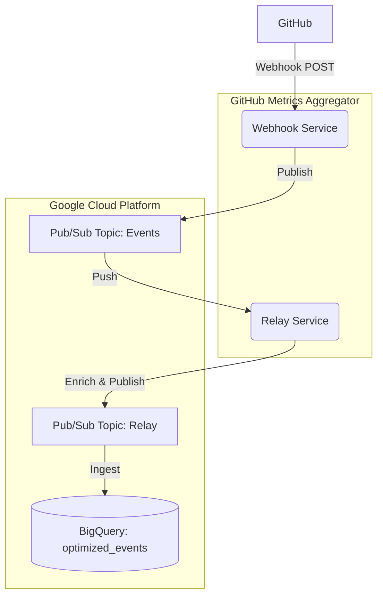
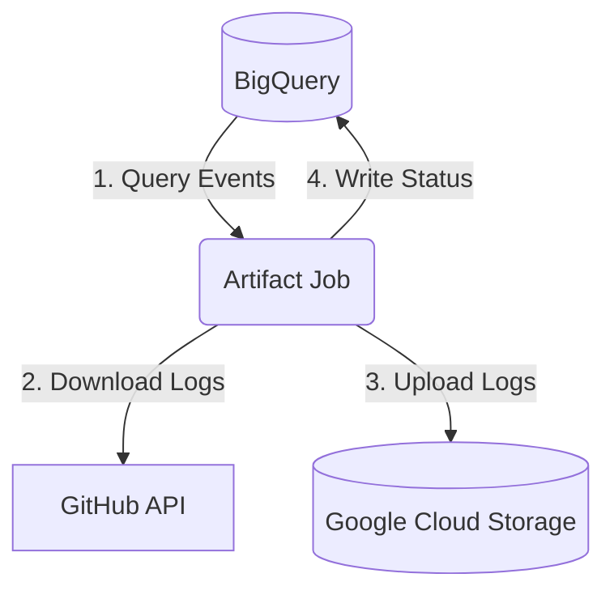
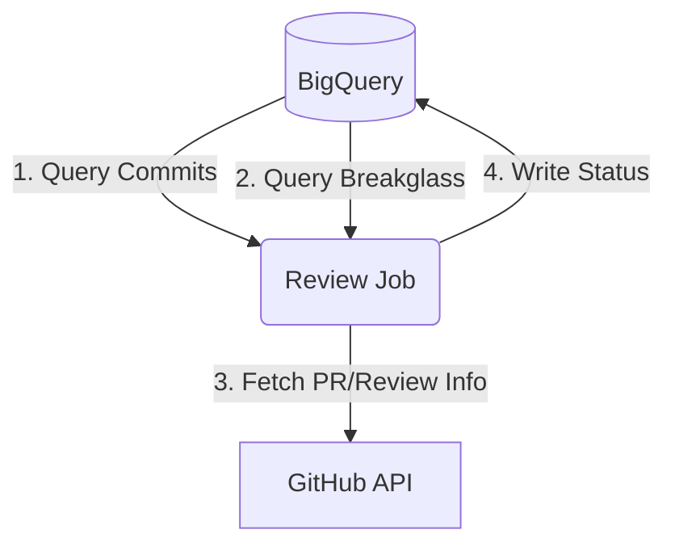
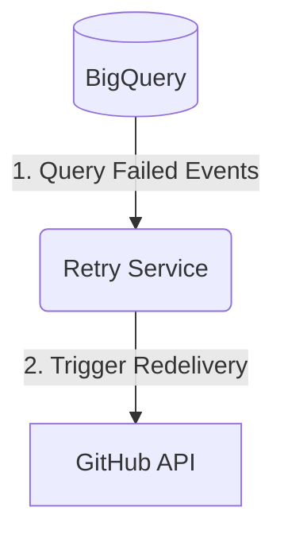
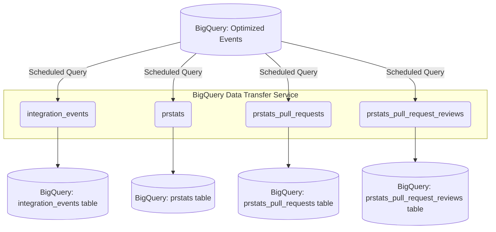

# GitHub Metrics Aggregator

GitHub Metrics Aggregator (GMA) is a system that ingests events from the GitHub API and creates dashboards about velocity and productivity.

It is made up of several components:
- **Webhook Service**: Ingests GitHub webhook event payloads and posts them to a Pub/Sub topic.
- **Retry Service**: Runs on a configurable cadence and redelivers events that failed to process.
- **Relay Service**: Enriches events with organizational metadata and relays them to another topic.
- **Artifact Job**: Ingests GitHub Action workflow logs to Google Cloud Storage.
- **Review Job**: Audits commits to verify they received proper review.

## Webhook and Relay Architecture


```mermaid
graph TD
    A[GitHub] -->|Webhook POST| B(Webhook Service)
    B -->|Publish| C[Pub/Sub Topic: Events]
    C -->|Push| D(Relay Service)
    D -->|Enrich & Publish| E[Pub/Sub Topic: Relay]
    E -->|Ingest| F[(BigQuery: optimized_events)]
    
    subgraph GMA [GitHub Metrics Aggregator]
        B
        D
    end
    
    subgraph GCP [Google Cloud Platform]
        C
        E
        F
    end
```

### Jobs Architecture

#### Artifact Job
Ingests GitHub Action workflow logs and stores them in Google Cloud Storage.


```mermaid
graph TD
    DB[(BigQuery)] -->|1. Query Events| J(Artifact Job)
    J -->|2. Download Logs| GH[GitHub API]
    J -->|3. Upload Logs| GCS[(Google Cloud Storage)]
    J -->|4. Write Status| DB
```

#### Review Job
Audits commits to verify they received proper review.


```mermaid
graph TD
    DB[(BigQuery)] -->|1. Query Commits| J(Review Job)
    DB -->|2. Query Breakglass| J
    J -->|3. Fetch PR/Review Info| GH[GitHub API]
    J -->|4. Write Status| DB
```

#### Retry Service
Redelivers events that failed to process.


```mermaid
graph TD
    DB[(BigQuery)] -->|1. Query Failed Events| J(Retry Service)
    J -->|2. Trigger Redelivery| GH[GitHub API]
```

### Scheduled Queries Architecture

The following diagram illustrates how the BigQuery Data Transfer Service runs scheduled queries to transform raw events into summary tables.


```mermaid
graph TD
    Source[(BigQuery: Optimized Events)] -->|Scheduled Query| Q1(integration_events)
    Source -->|Scheduled Query| Q2(prstats)
    Source -->|Scheduled Query| Q3(prstats_pull_requests)
    Source -->|Scheduled Query| Q4(prstats_pull_request_reviews)

    Q1 --> Dest1[(BigQuery: integration_events table)]
    Q2 --> Dest2[(BigQuery: prstats table)]
    Q3 --> Dest3[(BigQuery: prstats_pull_requests table)]
    Q4 --> Dest4[(BigQuery: prstats_pull_request_reviews table)]

    subgraph BQ_DTS [BigQuery Data Transfer Service]
        Q1
        Q2
        Q3
        Q4
    end
```

## Codebase Structure

This repository is organized as follows:

- **[`cmd`](./cmd)**: Main entry points for the application.
- **[`config`](./config)**: Metadata definitions for job parameters.
- **[`docs`](./docs)**: Documentation and playbooks.
- **[`integration`](./integration)**: End-to-end integration tests.
- **[`pkg`](./pkg)**: Core Go packages implementing the services and jobs.
  - **[`webhook`](./pkg/webhook)**: Ingests GitHub webhook events.
  - **[`retry`](./pkg/retry)**: Redelivers failed events.
  - **[`relay`](./pkg/relay)**: Enriches and relays events.
  - **[`review`](./pkg/review)**: Audits commit reviews.
  - **[`teeth`](./pkg/teeth)**: Posts log links in PR comments.
  - **[`artifact`](./pkg/artifact)**: Ingests workflow logs.
- **[`terraform`](./terraform)**: Infrastructure as Code definitions.
  - **[`bigquery`](./terraform/bigquery)**: Dataset and tables.
  - **[`pubsub`](./terraform/pubsub)**: Pub/Sub topics and subscriptions.
  - **[`gma`](./terraform/gma)**: Cloud Run services.
  - **[`scheduled_queries`](./terraform/scheduled_queries)**: BigQuery scheduled queries for aggregation.

## Setup

To set up the GitHub Metrics Aggregator, you need to provision the infrastructure and deploy the services.

### 1. Provision Infrastructure

We use Terraform to manage the infrastructure. Detailed documentation for the Terraform modules can be found in the [`terraform`](./terraform) directory.

To get started:
1. Navigate to the `terraform` directory.
2. Review [`example_main.tf`](./terraform/example_main.tf) for an example of how to use the modules.
3. Create your own `main.tf` based on the example and configure the variables.
4. Run `terraform init` and `terraform apply`.

See [`terraform/README.md`](./terraform/README.md) for more details on available modules and configuration options.

### 2. Create a GitHub App

Follow the directions from these [GitHub instructions](https://docs.github.com/en/apps/creating-github-apps/setting-up-a-github-app/creating-a-github-app#creating-a-github-app).
Grant the required permissions (e.g., Pull Requests, Pull Request Reviews) and subscribe to events.
Take note of the App ID and generate a private key.

### 3. Add Secrets

Store the GitHub App private key and webhook secret in Google Secret Manager. The Terraform module creates placeholders for these secrets.

### 4. Build and Deploy

After provisioning the infrastructure, you need to build the Docker image and deploy it to Cloud Run. You can use the generated Cloud Run services.

## Environment Variables

### Webhook Service

- `BIG_QUERY_PROJECT_ID`: (Optional) The project ID where your BigQuery instance exists in. Defaults to the `PROJECT_ID`.
- `DATASET_ID`: (Required) The dataset ID within the BigQuery instance.
- `EVENTS_TABLE_ID`: (Required) The event table ID.
- `FAILURE_EVENTS_TABLE_ID`: (Required) The failure event table ID.
- `PORT`: (Optional) The port where the webhook service will run on. Defaults to 8080.
- `PROJECT_ID`: (Required) The project where the webhook service exists in.
- `RETRY_LIMIT`: (Required) The number of retry attempts to make for failed GitHub event before writing to the DLQ.
- `EVENTS_TOPIC_ID`: (Required) The topic ID for PubSub.
- `DLQ_EVENTS_TOPIC_ID`: : (Required) The topic ID for PubSub DLQ where exhausted events are written.
- `GITHUB_WEBHOOK_SECRET`: Used to decrypt the payload from the webhook events.

### Retry Service

- `GITHUB_APP_ID`: (Required) The provisioned GitHub App reference.
- `GITHUB_PRIVATE_KEY`: (Required) A PEM encoded string representation of the GitHub App's private key.
- `BIG_QUERY_PROJECT_ID`: (Optional) The project ID where your BigQuery instance exists in. Defaults to the `PROJECT_ID`.
- `BUCKET_NAME`: (Required) The name of the bucket that holds the lock to enforce synchronous processing of the retry service.
- `CHECKPOINT_TABLE_ID`: (Required) The checkpoint table ID.
- `EVENTS_TABLE_ID`: (Required) The event table ID.
- `DATASET_ID`: (Required) The dataset ID within the BigQuery instance.
- `LOCK_TTL_CLOCK_SKEW`: (Optional) Duration to account for clock drift when considering the `LOCK_TTL`. Defaults to 10s.
- `LOCK_TTL`: (Optional) Duration for a lock to be active until it is allowed to be taken. Defaults to 5m.
- `PROJECT_ID`: (Required) The project where the retry service exists in.
- `PORT`: (Optional) The port where the retry service will run on. Defaults to 8080.
- `LOG_MODE`: (Required) The mode for logs. Defaults to production.
- `LOG_LEVEL`: (Required) The level for logging. Defaults to warning.
- `GITHUB_ENTERPRISE_SERVER_URL`: (Optional) The GitHub Enterprise server URL if available, format \"https://[hostname]\".

### Relay Service

- `PORT`: (Optional) The port the relay server listens to. Defaults to 8080.
- `PROJECT_ID`: (Required) Google Cloud project ID where this service runs.
- `RELAY_TOPIC_ID`: (Required) Google PubSub topic ID.
- `RELAY_PROJECT_ID`: (Required) Google Cloud project ID where the relay topic lives.
- `PUBSUB_TIMEOUT`: (Optional) The timeout for PubSub requests. Defaults to 10s.

### Artifact Job

- `GITHUB_APP_ID`: (Required) The provisioned GitHub App ID.
- `GITHUB_PRIVATE_KEY` or `GITHUB_PRIVATE_KEY_SECRET_ID` or `GITHUB_PRIVATE_KEY_KMS_KEY_ID`: (Required) Authentication for GitHub App.
- `BUCKET_NAME`: (Required) The name of the bucket that holds artifact logs files from GitHub.
- `EVENTS_TABLE_ID`: (Required) The events table ID within the dataset.
- `ARTIFACTS_TABLE_ID`: (Required) The artifacts table ID within the dataset.
- `PROJECT_ID`: (Required) Google Cloud project ID.
- `DATASET_ID`: (Required) BigQuery dataset ID.
- `BATCH_SIZE`: (Optional) The number of items to process in this execution. Defaults to 100.

### Review Job

- `GITHUB_APP_ID`: (Required) The provisioned GitHub App ID.
- `GITHUB_PRIVATE_KEY` or `GITHUB_PRIVATE_KEY_SECRET_ID` or `GITHUB_PRIVATE_KEY_KMS_KEY_ID`: (Required) Authentication for GitHub App.
- `EVENTS_TABLE_ID`: (Required) The events table ID within the dataset.
- `COMMIT_REVIEW_STATUS_TABLE_ID`: (Required) The commit_review_status table ID within the dataset.
- `PROJECT_ID`: (Required) Google Cloud project ID.
- `DATASET_ID`: (Required) BigQuery dataset ID.

## Testing Locally

### Creating GitHub HMAC Signature

```bash
echo -n `cat testdata/issues.json` | openssl sha256 -hmac "test-secret"

# Output:
08a88fe31f89ab81a944e51e51f55ebf9733cb958dd83276040fd496e5be396a
```

Use this value in the `X-Hub-Signature-256` request header as follows:

```bash
X-Hub-Signature-256: sha256=08a88fe31f89ab81a944e51e51f55ebf9733cb958dd83276040fd496e5be396a
```

### Example Request

```bash
PAYLOAD=$(echo -n `cat testdata/issues.json`)
GITHUB_WEBHOOK_SECRET="test-secret"

curl \
  -H "Content-Type: application/json" \
  -H "X-Github-Delivery: $(uuidgen)" \
  -H "X-Github-Event: issues" \
  -H "X-Hub-Signature-256: sha256=$(echo -n $PAYLOAD | openssl sha256 -hmac $GITHUB_WEBHOOK_SECRET)" \
  -d $PAYLOAD \
  http://localhost:8080/webhook

# Output
Ok
```
